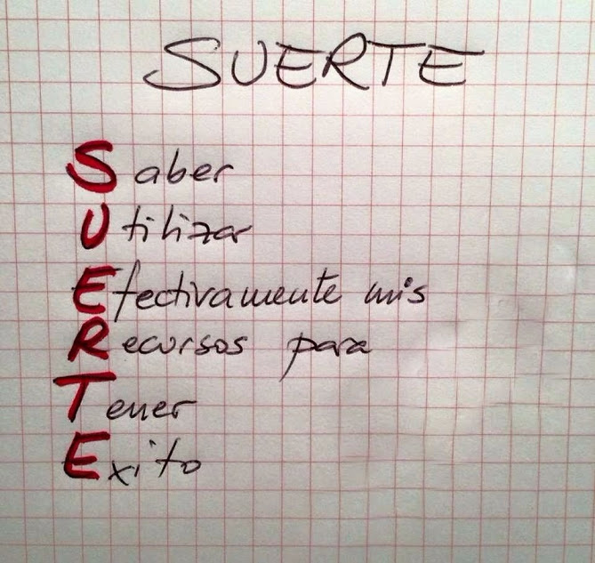

# PachaQTecMayo2020
Curso de Especialización de Programación BackEnd PachaQtec Mayo 2020
## DESARROLLO BACK-END
### Hackaton Semana 4
#### Se requiere lo siguiente:

 - Realizar un programa de inventarios que permita:
	 - Productos
		 - Agregar Productos
		 - Validar Existencia
		 - Quitar Productos
		 - Listar Productos
		 - Inventariar productos
			 - Contar los productos
			 - Valorizar los productos
	
	 - Clientes
		 - Validar existencia
		 - Crear Cliente
		 - Ver Cliente
	
	 - Empleados
		 - Validar Existencia
		 - Crear Empleado
		 - Ver Empleado
		
 - Usar los siguientes tipos de datos
	 - Strings
	 - Int
	 - Float
	 - Tuplas
	 - Listas
	 - Diccionarios
 - Usar los siguientes controles de flujo
	 - For
	 - While
	 - Break
 - Usar el manejo de las excepciones
	 - Try
	 - Except
	 - Finally
	
 - Usar Clases
	 - Clase Persona
	 - Clase Empleado
	 - Clase Cliente
	 - Clase Producto

	
#### Se calificará de la siguiente manera
 - Tendrán la calificación de 4 las personas que ejecuten el menú correctamente
 - Tendrán la calificación de 8 las personas que agreguen , listen y  eliminen(producto) productos, empleados, clientes
 - Tendrán la calificación de 12 las personas que listen y hagan el inventario de los productos
 - Tendrán la calificación de 16 las personas que hagan uso de las excepciones y clases
 - Tendrán la calificación de 20 quienes pongan un valor agregado a su trabajo 

  
## Mucha suerte
